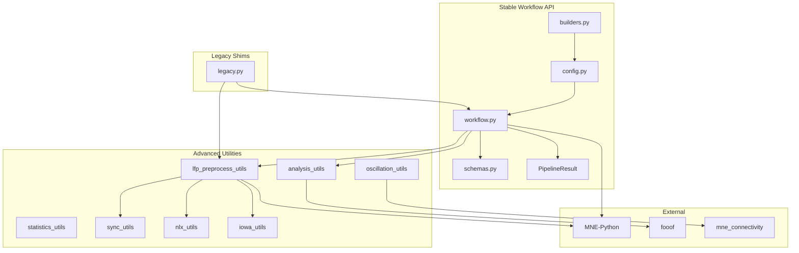
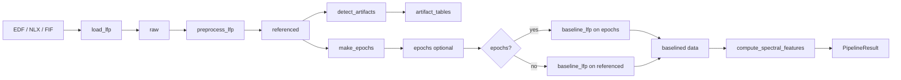

# AI Context: LFPAnalysis

This document gives an accurate mental model of the LFPAnalysis repository for AI agents and new contributors. It is grounded in the current code, tests, and CI — not an aspirational design.

**Related:** [AI_PLAYBOOK.md](AI_PLAYBOOK.md) for how-to guidance. **Canonical user docs:** [LFPAnalysisBook/](../LFPAnalysisBook/).

---

## Overall architecture

LFPAnalysis is a Python library for standardized human intracranial / local field potential (LFP) analysis. It wraps **MNE-Python** with a typed workflow API, legacy compatibility shims, and large utility modules for site-specific preprocessing, time-frequency analysis, connectivity, and statistics.

### Three layers

| Layer | Location | Purpose |
|-------|----------|---------|
| **Stable workflow API** | `LFPAnalysis/config.py`, `builders.py`, `workflow.py`, `results.py`, `schemas.py`, `validation.py`, `exceptions.py` | Typed configs, staged pipeline, standardized outputs |
| **Legacy shims** | `LFPAnalysis/legacy.py` | Deprecation-wrapped bridges from old notebook entry points |
| **Advanced utilities** | `lfp_preprocess_utils.py`, `oscillation_utils.py`, `statistics_utils.py`, `sync_utils.py`, `nlx_utils.py`, `iowa_utils.py`, `analysis_utils.py` | Site-specific I/O, TFR, connectivity, PAC, surrogates, ROI logic |

Public exports are defined in [`LFPAnalysis/__init__.py`](../LFPAnalysis/__init__.py). The stable API is the recommended entry point; utilities are for workflows not yet covered by `run_pipeline`.

### Architecture diagram



### What is stable vs transitional vs advanced

| Category | Examples |
|----------|----------|
| **Stable** | `PipelineConfig`, `build_*_pipeline_config`, `run_pipeline`, artifact/baseline table schemas |
| **Transitional** | `LFPAnalysis.legacy.make_mne`, `ref_mne`, `make_epochs`, `compute_and_baseline_tfr` |
| **Advanced only** | Most TFR orchestration, connectivity (`compute_connectivity`), eBOSC, time-resolved MLM, `laplacian` reference |

---

## Important abstractions

### Configuration dataclasses (`config.py`)

All use `@dataclass(slots=True)`:

| Class | Role |
|-------|------|
| `LoadConfig` | Path, format (`edf` / `neuralynx` / `mne`), resample, channel picks, NLX name lists |
| `ReferenceConfig` | `none` / `bipolar` / `wm` / `laplacian`, electrode path, site (`MSSM` default) |
| `ArtifactConfig` | Methods list, IED/misc thresholds, optional `custom_detector` |
| `BaselineConfig` | Mode, enabled flag, `baseline_window` tuple |
| `EpochConfig` | Event times, slope/offset, tmin/tmax, optional metadata |
| `SpectralConfig` | `psd` / `fooof`, frequency ranges, FOOOF kwargs |
| `PipelineConfig` | Composes all of the above |

### Method registries (`workflow.py`)

Config string values must belong to these sets (enforced by `ensure_supported`):

```python
REFERENCE_METHODS = {"none", "bipolar", "wm", "laplacian"}
ARTIFACT_METHODS = {"none", "misc", "ied", "custom"}
BASELINE_METHODS = {"none", "mean", "ratio", "percent", "zscore", "logratio", "zlogratio", "trialwise", "continuous"}
SPECTRAL_METHODS = {"none", "psd", "fooof"}
```

`laplacian` is in the registry but raises `ConfigurationError` — implementation is not complete.

### `run_pipeline` stages

Single orchestrator in `workflow.py`:

1. `load_lfp` → MNE `Raw` or `Epochs`
2. `preprocess_lfp` → re-referenced `Raw`
3. `detect_artifacts` → dict of standardized DataFrames
4. `make_epochs` → optional `Epochs` (from **referenced** raw, not baselined)
5. `baseline_lfp` → applied to epochs if present, else referenced raw
6. `compute_spectral_features` → optional PSD/FOOOF dict
7. Returns `PipelineResult`

### `PipelineResult` (`results.py`)

| Field | Type | Content |
|-------|------|---------|
| `raw` | MNE object | Unmodified load |
| `referenced` | MNE object | After referencing (+ baselining if no epochs) |
| `epochs` | MNE Epochs or None | Event-locked data (baselined if enabled) |
| `artifact_tables` | `dict[str, pd.DataFrame]` | Per-method artifact events |
| `baseline_summary` | `pd.DataFrame` | Per-channel baseline stats |
| `spectral` | `dict` | PSD spectrum or FOOOF group/table |
| `metadata` | `dict` | Run summary (formats, methods used) |

### Standardized table schemas (`schemas.py`)

```python
ARTIFACT_EVENT_COLUMNS = ("event_kind", "channel", "time_seconds", "sample_index")
BASELINE_SUMMARY_COLUMNS = ("target", "channel", "mode", "baseline_start", "baseline_stop", "baseline_mean", "baseline_std")
ELECTRODE_REQUIRED_COLUMNS = ("label",)
```

Empty tables use the same column names (never omit the schema).

### Validation gate (`validation.py`)

- `ensure_supported(value, field_name, supported)` → `ConfigurationError` if invalid
- `ensure_dependency(module_name)` → `MissingDependencyError` with install hint
- `resolve_existing_path(path)` → resolved `Path` or `ConfigurationError`
- `validate_required_columns(df, required_columns)` → `DataContractError`

### Site branching

| Parameter | MSSM (default) | Iowa (UI) |
|-----------|----------------|-----------|
| `ReferenceConfig.site` | `"MSSM"` | `"UI"` |
| sEEG channel names | `la1`, `rh3`, … (lowercase `l`/`r` prefix) | `lfpx12`, … |
| Electrode coords | `x`, `y`, `z` | `mni_x`, `mni_y`, `mni_z` |
| WM reference | `manual` + `gm` columns required | `DesikanKilliany` contains `"white"` |
| Raw input | EDF or Neuralynx | Neuralynx (`LFP*.ncs`) |

Site string is **`"UI"`**, not `"Iowa"`.

### Builder convenience functions (`builders.py`)

| Function | Use case |
|----------|----------|
| `build_basic_pipeline_config` | First load, optional reference/artifacts |
| `build_event_locked_pipeline_config` | Epoch + baseline around behavioral events |
| `build_spectral_pipeline_config` | PSD or FOOOF (stable methods only) |

TFR and connectivity are **not** in builders; use utility modules after preprocessing.

---

## Data flow

### Stable pipeline flow



**Important:** Artifacts are detected on referenced continuous data **before** epoching. Baselining runs on epochs (if created) or on referenced raw.

### Utility delegation from stable layer

| Stable function | Delegates to |
|-----------------|--------------|
| `load_lfp` (neuralynx) | `nlx_utils.parse_subject_nlx_data` |
| `preprocess_lfp` (wm/bipolar) | `lfp_preprocess_utils.ref_mne` |
| `detect_artifacts` (misc) | `lfp_preprocess_utils.detect_misc_artifacts` |
| `detect_artifacts` (ied) | `lfp_preprocess_utils.detect_IEDs` |
| `baseline_lfp` | `lfp_preprocess_utils.mean_baseline_time` |
| `compute_spectral_features` (fooof) | `analysis_utils.FOOOF_compute_epochs` |

Legacy `make_mne` additionally uses `iowa_utils`, `sync_utils`, and full `lfp_preprocess_utils.make_mne` for folder-oriented EDF/NLX workflows.

### Advanced utility pipeline (not in `run_pipeline`)

Typical lab workflow beyond the stable API:

1. `make_mne` / `load_lfp` → `Raw`
2. `ref_mne` → referenced `Raw`
3. `synchronize_data` (photodiode/TTL) → slope/offset for behavioral times
4. `make_epochs` → `Epochs` + IED/artifact CSV sidecars
5. `compute_and_baseline_tfr` → `{event}-tfr.h5`
6. `oscillation_utils.compute_connectivity` → connectivity with surrogates
7. `statistics_utils.time_resolved_mlm` → time-resolved mixed models

### File sidecar conventions (legacy utilities)

| Pattern | Content |
|---------|---------|
| `{event}-epo.fif` | Epoched MNE data |
| `{event}_IED_df.csv` | IED detection results |
| `{event}_artifact_df.csv` | Misc artifact results |
| `{event}-tfr.h5` | Baseline-corrected TFR |
| `lfp_data.fif` | Default continuous save from `make_mne` |

---

## File organization

```
LFPAnalysis/                    # Repository root
├── LFPAnalysis/                # Python package
│   ├── __init__.py             # Stable public exports
│   ├── config.py               # Typed dataclasses
│   ├── builders.py             # Pipeline config builders
│   ├── workflow.py             # Stable staged API + run_pipeline
│   ├── results.py              # PipelineResult
│   ├── schemas.py              # Table column contracts
│   ├── validation.py           # Config/path validation
│   ├── exceptions.py           # LFPAnalysisError hierarchy
│   ├── legacy.py               # Deprecation shims
│   ├── lfp_preprocess_utils.py # Load, ref, artifacts, TFR (~122 KB)
│   ├── oscillation_utils.py    # Connectivity, PAC, surrogates, eBOSC (~175 KB)
│   ├── analysis_utils.py       # ROI selection, FOOOF, STA, bursts
│   ├── statistics_utils.py     # Permutation regression, time-resolved MLM
│   ├── sync_utils.py           # Photodiode/TTL behavioral sync
│   ├── nlx_utils.py            # Neuralynx .ncs/.nev I/O
│   ├── iowa_utils.py           # Iowa site channel tables
│   └── YBA_ROI_labelled.xlsx   # Packaged ROI lookup table
├── LFPAnalysisBook/            # Jupyter Book (canonical user docs)
│   ├── 00–11_*.md              # Beginner track
│   ├── 20–25_*.md              # Migration from old repo
│   ├── 30_troubleshooting.md
│   ├── smoke-tests/            # CI notebook smoke tests (7 notebooks)
│   └── worked-examples/        # Tutorial notebooks (7 notebooks)
├── tests/                      # Pytest suite + tests/data/
├── data/                       # Sample FIF/CSV/XLSX for docs and smoke tests
├── scripts/                    # Non-canonical exploratory notebooks
├── docs/                       # AI/contributor context (this folder)
├── noxfile.py                  # lint, tests, docs, notebooks sessions
├── pyproject.toml              # Package metadata, Ruff, optional deps
├── pytest.ini                  # Markers and test paths
└── .github/workflows/ci.yml    # CI jobs
```

### Documentation tracks (`LFPAnalysisBook/`)

- **Beginner track (00–11):** load → reference → artifacts → baseline → epoching → PSD/FOOOF → TFR → connectivity
- **Migration track (20–25):** old notebook mental model, function mapping, workflow translations
- **Smoke tests:** deterministic, bounded notebook runs for CI
- **Worked examples:** richer tutorials executed partially in CI

### Sample data (`data/`)

Used by book notebooks and macOS CI smoke — **not** by unit tests (those use synthetic fixtures):

- `sample_ieeg.fif`, `sample_ieeg_continuous_rest.fif`, `sample_ieeg_bp.fif`
- `sample_*-epo.fif`, `sample_beh.csv`, `sample_labels.xlsx`
- Artifact/IED sidecar CSVs, `YBA_ROI_labelled.xlsx`

---

## Hidden assumptions

### Channel naming

- All channel names are **lowercased** after load; spaces stripped.
- **MSSM sEEG:** hemisphere prefix `l` or `r` (e.g. `la1`, `rh3`). Micros: prefix `u` (dropped unless `include_micros=True`).
- **Iowa sEEG:** `lfpx{N}` from connection or electrode tables.
- Bipolar labels after reref: `la1-la2` style.
- NLX channel names derived from filename stem, `_0000` suffix stripped.

### Electrode metadata

| Context | Required / expected |
|---------|---------------------|
| Stable `load_electrode_metadata` | `label` column only (validated) |
| MSSM `wm_ref` | `label`, `x`, `y`, `z`, **`manual`** (raises if missing), `gm` for WM/OOB |
| MSSM bipolar | Ordered contacts within probe bundles |
| Iowa | `Channel` → `lfpx{N}`, `mni_x/y/z`, `DesikanKilliany`, `ElectrodeType` |
| ROI analysis (`analysis_utils`) | `NMM`, `BN246`, `YBA_1`, `collapsed_manual`, derived `salman_region` |

The package does **not** perform electrode localization; it consumes existing tables.

### Time units

- Behavioral event times for `make_epochs` / `EpochConfig.event_times`: **seconds**.
- `EpochConfig.slope` and `offset` apply linear transform: `neural_time = beh_time * slope + offset`.
- Sync utilities (`sync_utils`) may receive behavioral times in ms from external tools; sync returns `(slope, offset)` for conversion.
- Mixing ms and seconds is the most common user error.

### Sampling rate and filtering

- Default resample: **500 Hz** (`make_mne`, `LoadConfig.resample_sfreq`).
- Line frequency: **60 Hz** with notch at 60/120/180/240 Hz.
- Neuralynx: all loaded channels must share one sampling rate (stable API enforces this).

### MNE object expectations

| Function area | Expected type |
|---------------|---------------|
| `load_lfp` | Returns `mne.io.Raw` or `mne.Epochs` |
| `preprocess_lfp`, `detect_artifacts` | `Raw` (continuous) |
| `make_epochs` | `Raw` in → `Epochs` out |
| `baseline_lfp` | `Raw` or `Epochs` |
| `compute_spectral_features` (fooof) | `Epochs` only in stable layer |
| TFR utilities | `Epochs` or `EpochsTFR`, shape `(n_epochs, n_channels, n_freqs, n_times)` |
| Connectivity | `Epochs` `(n_epochs, n_channels, n_times)` |

### Determinism (partial)

- `oscillation_utils` surrogates: `rng_seed=42` default, `np.random.default_rng(rng_seed)`.
- `statistics_utils` permutations: uses `np.random.permutation` **without** explicit seeding — **not reproducible** unless caller sets global `np.random.seed`.
- Documented invariant ("pass `rng_seed` for determinism") applies fully to oscillation/surrogate code only today.

### Incomplete / stub surfaces

These are publicly importable but incomplete — may `pass` or return `None` silently:

| Symbol | Status |
|--------|--------|
| `laplacian` reference | Registry entry; stable API raises `ConfigurationError` |
| `analysis_utils.FOOOF_continuous`, `sliding_FOOOF` | `pass` stubs |
| `sync_utils.get_behav_ts` | `pass` stub |
| `nlx_utils.merge_multiple_ncs_files` | Incomplete |
| `iowa_utils.rename_mne_channels` | Incomplete body |

### Optional dependencies

| Extra | Install | Needed for |
|-------|---------|------------|
| base | `pip install -e .` | MNE, pandas, scipy, core workflow |
| `analysis` | `pip install -e .[analysis]` | fooof, mne-connectivity, tensorpac, neurodsp, pycatch22, statsmodels |
| `dev` | `pip install -e .[dev]` | ruff, pytest, nox, jupyter-book, all analysis deps |

`fooof` is pinned to `==1.0.0` (upstream renamed to `specparam`).

### No `__all__` in utility modules

Utility modules export every non-underscore name implicitly. There is no formal "public utility API" boundary — treat underscore-prefixed helpers as private.

---

## Common pitfalls

### Configuration and workflow

- **Skipping the interface guide** — importing `lfp_preprocess_utils` before trying `run_pipeline` leads to wrong assumptions about defaults.
- **Assuming legacy shims mean stable API parity** — `legacy.compute_and_baseline_tfr` delegates to the full legacy implementation; stable API does not yet cover TFR.
- **Using `laplacian` reference** — will fail with `ConfigurationError`.
- **FOOOF on continuous raw via stable API** — raises `MissingDependencyError` / not implemented for non-epochs.
- **`build_spectral_pipeline_config` with TFR/connectivity** — raises `ConfigurationError`; use utility modules.

### Data and metadata

- **Mismatched channel labels** — referencing failures are usually electrode table problems, not signal problems. Validate `label` matches MNE `ch_names`.
- **Missing `manual` column for MSSM white-matter ref** — `wm_ref` raises explicitly.
- **Milliseconds vs seconds** in `event_times` — produces wrong epoch alignment.
- **Baseline window outside data** — stable API now raises `ConfigurationError` (previously could fail silently).

### Artifacts and empty outputs

- **Empty artifact tables** — either method was `none` or thresholds found no events. This is valid, not an error.
- **Artifacts detected before epoching** — IED times on continuous data; epoch-specific IED dicts require the legacy `make_epochs` path with `IED_args`.

### Automation hazards

- **`match_elec_names` interactive prompt** — on ambiguous Levenshtein ties, calls `input()` and will hang CI/agents. Avoid in non-interactive contexts.
- **Non-reproducible statistics** — `statistics_utils` permutations are not seeded; do not assume run-to-run stability.

### Dependency errors

- Missing `fooof` or `mne_connectivity` — install `.[analysis]` or `.[dev]`, not base install alone.

---

## Coding conventions

### Style and linting

- **Ruff:** line length 100, rules `E`, `F`, `I`, `W`, ignore `E501` ([`pyproject.toml`](../pyproject.toml))
- **`.editorconfig`:** UTF-8, LF, 4-space indent, final newline; `[*.md]` preserves trailing whitespace
- **Pre-commit:** merge-conflict check, EOF, trailing whitespace, YAML, large files, `ruff` lint + format

### Python patterns

- `from __future__ import annotations` in newer modules
- `@dataclass(slots=True)` for config and result types
- NumPy-style docstrings with `Parameters` / `Returns` sections
- Project exceptions (`ConfigurationError`, `DataContractError`, `MissingDependencyError`) instead of bare `ValueError`/`KeyError` at API boundaries
- Lazy optional imports via `ensure_dependency()` rather than top-level imports of heavy analysis packages

### Testing conventions

- Synthetic MNE objects in fixtures, not large binaries in unit tests
- `tests/data/electrodes.csv` for electrode validation tests
- Repo `data/` reserved for docs, smoke tests, integration-oriented examples

### Documentation conventions

- User-facing tutorials live in `LFPAnalysisBook/`, not `scripts/`
- Book changes require `nox -s docs` and `nox -s notebooks`
- `test_docs_content.py` validates chapter structure and migration examples

---

## Important invariants

1. **Registry membership** — config method strings must be in the corresponding `*_METHODS` set in `workflow.py`.
2. **Schema columns** — artifact and baseline output DataFrames always include the full column tuple, even when empty.
3. **Dependency gating** — optional packages imported only through `ensure_dependency` with install hints.
4. **Neuralynx sampling rate** — all channels in one load must share `sfreq`.
5. **Epoch metadata length** — `len(epoch.metadata) == len(event_times)` when metadata is provided.
6. **Path existence** — `resolve_existing_path` before file reads in stable API.
7. **Electrode contract** — `label` column required for `load_electrode_metadata`.
8. **Surrogate determinism** — pass explicit `rng_seed` to `oscillation_utils` surrogate functions for reproducibility.
9. **Pipeline stage order** — load → reference → artifacts → epoch → baseline → spectral; do not reorder without updating tests and docs.
10. **Baselining target** — epochs if epoching enabled, else referenced continuous data.

---

## Frequently modified files

These files change most often and are guarded by CI coverage or doc tests:

### Stable API (80% coverage gate in CI)

| File | Why |
|------|-----|
| [`LFPAnalysis/workflow.py`](../LFPAnalysis/workflow.py) | Core pipeline logic, registries, delegation |
| [`LFPAnalysis/builders.py`](../LFPAnalysis/builders.py) | Beginner-facing config constructors |
| [`LFPAnalysis/legacy.py`](../LFPAnalysis/legacy.py) | Compatibility shims |
| [`LFPAnalysis/config.py`](../LFPAnalysis/config.py) | New config fields and Literals |
| [`LFPAnalysis/schemas.py`](../LFPAnalysis/schemas.py) | Output table contracts |

### Utility modules (large, analysis-heavy)

| File | Why |
|------|-----|
| [`LFPAnalysis/lfp_preprocess_utils.py`](../LFPAnalysis/lfp_preprocess_utils.py) | Load, ref, artifacts, TFR baselining |
| [`LFPAnalysis/oscillation_utils.py`](../LFPAnalysis/oscillation_utils.py) | Connectivity, surrogates, eBOSC |
| [`LFPAnalysis/analysis_utils.py`](../LFPAnalysis/analysis_utils.py) | FOOOF, ROI selection, burst detection |
| [`LFPAnalysis/statistics_utils.py`](../LFPAnalysis/statistics_utils.py) | Time-resolved regression |
| [`LFPAnalysis/nlx_utils.py`](../LFPAnalysis/nlx_utils.py) | Neuralynx I/O |
| [`LFPAnalysis/iowa_utils.py`](../LFPAnalysis/iowa_utils.py) | Iowa site conventions |

### Tests and docs

| Path | Why |
|------|-----|
| `tests/test_workflow_*.py` | Stable API regression |
| `tests/test_*_assessment.py` | Utility tests with stubbed deps |
| `LFPAnalysisBook/*.md` | Chapter content validated by `test_docs_content.py` |
| `LFPAnalysisBook/smoke-tests/` | CI notebook execution |
| `LFPAnalysisBook/worked-examples/` | Tutorial notebooks |

### Infrastructure

| File | Why |
|------|-----|
| [`noxfile.py`](../noxfile.py) | Local/CI session definitions |
| [`.github/workflows/ci.yml`](../.github/workflows/ci.yml) | CI matrix (Python 3.10–3.12) |
| [`pyproject.toml`](../pyproject.toml) | Dependencies, version, Ruff config |

---

## Quick reference: which entry point?

| Goal | Entry point |
|------|-------------|
| Load sample data | `build_basic_pipeline_config` + `run_pipeline` |
| Event-locked analysis | `build_event_locked_pipeline_config` |
| PSD / FOOOF | `build_spectral_pipeline_config` |
| Old notebook code | `LFPAnalysis.legacy` + migration chapters 20–25 |
| TFR / connectivity | Utility modules after stable preprocessing; see chapter 11 |
| ROI-based channel selection | `analysis_utils.select_picks_rois`, `select_rois_picks` |
